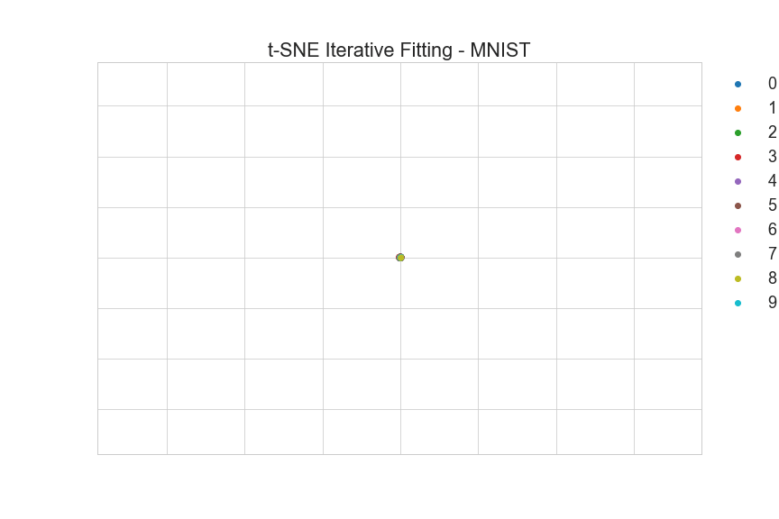

# t-SNE
A python package and analysis of the t-SNE dimensionality reduction technique.


# Installation
You can install the package from pip:

`pip install simple-tsne`

# Usage

The core functionality of the package lives in the `tsne` function.

The following example runs tsne on the MNIST dataset:

```python
from simple-tsne import tsne, momentum_func
from sklearn.datasets import load_digits
import matplotlib.pyplot as plt

digits, digit_class = load_digits(return_X_y=True)
low_dim = tsne(
    data=digits, # Data is mxn numpy array, each row a point
    n_components=2, # Number of dim to embed to
    perp=30, # Perplexity (higher for more spread out data)
    n_iter=500, # Iterations to run t-SNE for
    lr=100, # Learning rate
    momentum_fn=momentum_func, # Function returning momentum coefficient, this one is the default update schedule
    pbar=True, # Show progress bar
    random_state=42 # Seed for random initialization
)
```